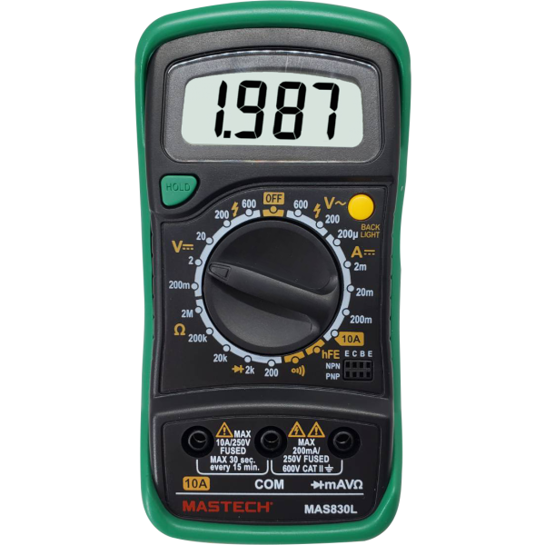
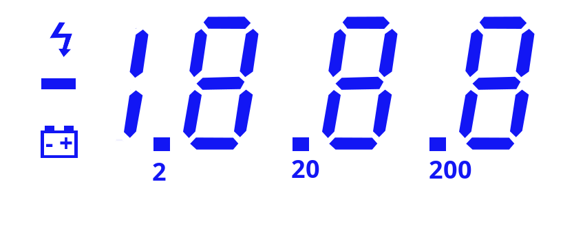

# MultimeterHack
I plan to create a system to read and visualize the data from my digital multimeter on a computer. My multimeter has a digital display showing all measurement outputs. The idea is to capture this data directly from the display and send it to a PC for real-time monitoring.


### MAS830L




```

Feature

● Display 2000 counts. 
● Diode Open Voltage 3.0V.
● Data Hold. 
● Low Battery Display. 
● Transistor Test.
● Continuity Buzzer <70 ±30Ω. 
● Display Backlight. 
 

https://www.mastech-group.com/global/en/mas830l.html


```





**Project: Multimeter Data Interface**

I plan to create a system to read and visualize the data from my digital multimeter on a computer. My multimeter has a digital display showing all measurement outputs. The idea is to capture this data directly from the display and send it to a PC for real-time monitoring.

**Approach:**

1. **Display Interface:** Connect the multimeter’s digital display pins to the digital I/O pins of a microcontroller.
2. **Data Capture:** Track which segments of the display are active to determine the measurement values.
3. **Computer Connection:** Use the microcontroller’s USB/serial interface to send the captured data to the PC.
4. **Visualization:** Display the readings on a computer program for easy monitoring and logging.

This project allows converting a standalone multimeter into a **PC-readable measurement device**, useful for logging, automation, or analysis.


1. **Identify Display Type**

   * Most multimeters use **7-segment LCD or LED displays**.
   * You need to figure out which pins control which segments.

2. **Connect to Microcontroller**

   * Use something like **Arduino, ESP32, or Teensy**.
   * Connect microcontroller digital pins to the multimeter display pins carefully.
   * Avoid drawing too much current from the multimeter’s display (use resistors if needed).

3. **Read Display Data**

   * You can scan **segment pins** to see which ones are ON/OFF.
   * Map segments to numbers (e.g., 7-segment encoding).

4. **Send Data to Computer**

   * Use **Serial over USB**.
   * Microcontroller reads display → converts to numeric value → sends to PC.

5. **PC Visualization**

   * On PC, use a **Python script or Processing** to read serial data and display readings live.


**block diagram**

```
       ┌────────────┐
       │  Solar     │
       │  Panel 12V │
       └─────┬──────┘
             │
             ▼
       ┌────────────┐
       │ Multimeter │
       │  (Voltage  │
       │   & Current│
       │   Reading) │
       └─────┬──────┘
             │ Digital I/O
             ▼
       ┌────────────┐
       │  Arduino   │
       │ (Read Seg- │
       │  ments &   │
       │   Send via │
       │   Serial)  │
       └─────┬──────┘
             │ USB / Serial
             ▼
       ┌────────────┐
       │   PC /     │
       │  Display   │
       │ (Voltage & │
       │   Watts)   │
       └────────────┘
```

This shows the **flow from solar panel → multimeter → Arduino → PC**, clearly for monitoring voltage and wattage 24/7.


